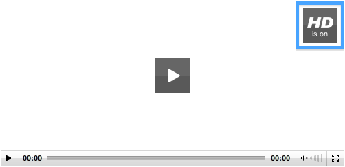

.. _overview:

HD Plugin for the JW Player
=======================================================

Introduction
------------

The HD plugin for the JW Player gives your viewers a way to toggle between high definition and standard definition videos. It works with all playback methods and playlist formats supported by the JW Player and even stores the viewer's quality preference so that they use a consistent video quality throughout playback. Additionally, the plugin's appearance can be completely customized using the player's skins, so it'll look like it was built into the player from the start.

We recommend using the HD plugin if you're serving progressively downloaded videos or if your server bandwidth comes at a premium. If you're using an HTTP / RTMP streaming server (and costs / bandwidth are not an issue),  we recommend using the player's built-in bitrate switching to deliver the best experience for your viewers.

	.. note::
		- When the HD plugin is used in conjunction with progressively downloaded video files, toggling video quality will cause the video to restart playback from the beginning. This is because it is not possible to seek to an arbitrary point within progressively downloaded videos. 
		
		- When the HD plugin is used in conjunction with an HTTP / RTMP streaming server, the video will resume playback at the position that was being played when the quality switch was initiated. Additionally, the *start* configuration parameter is respected when playback begins and when switching between playlist items. For this reason, we recommend using the HD plugin with an HTTP or RTMP streaming server to ensure the best possible user experience.
		
		- The HD plugin is not compatible with the player's built-in bitrate switching mechanism. Bitrate switching provides an amazing user experience because it automatically adjusts the video quality to the bandwidth and screen estate of the viewer. However, automatic bitrate switching is only available for RTMP and HTTP streaming servers as progressively downloaded videos restart when switching quality, causing viewer confusion.

Examples
--------
To get started, you'll need to have two versions of your video available, one high definition and one standard definition. Once you've got these up and running on your server, configuring the player is quick and easy!

In the examples below, we'll use hd-video.mp4 to refer to the high definition video and sd-video.mp4 to refer to the standard definition video.

	.. note::
		- These examples use SWFObject 2.X. Please see our Embedding Flash and Configuring the JW Player tutorials for additional information. 

Basic Setup
^^^^^^^^^^^
This is the recommended setup for HD, with HD enabled by default.

The standard definition video is specified using the player's built-in *file* configuration parameter. Next, we specify the high definition video using the plugin's *hd.file* configuration parameter and enable high definition by default by setting *hd.state* to true.

.. code-block:: html

	

RTMP Stream with Fullscreen Toggle
^^^^^^^^^^^^^^^^^^^^^^^^^^^^^^^^^^
This configuration uses a standard RTMP streaming server with the HD plugin to switch video quality when entering and exiting fullscreen mode.

The streamer server and standard definition video file are specified using the player's built-in *streamer* and *file* configuration parameters per usual. Next, we specify the high definition video using the plugin's *hd.file* configuration parameter and enable fullscreen high definition switching setting *hd.fullscreen* to true.

.. code-block:: html

	

Playlist with HD Disabled by Default
^^^^^^^^^^^^^^^^^^^^^^^^^^^^^^^^^^^^
This configuration uses a modified playlist with the HD plugin to switch video quality when entering and exiting fullscreen mode.

The special playlist is specified using the player's built-in *playlistfile* configuration parameter and disable high definition by default by setting *hd.state* configuration parameter to false.

.. code-block:: html

	

Additionally, we add another *jwplayer* namespace parameter, *jwplayer:hd.file*, to each item with a high definition video.
	
.. code-block:: html

  <rss version="2.0" xmlns:jwplayer="http://developer.longtailvideo.com/">
    <channel>
      <item>
        <title>My first video</title>
        <jwplayer:file>sd-video1.mp4</jwplayer:file>
        <jwplayer:hd.file>hd-video1.mp4</jwplayer:hd.file>
      </item>
      <item>
        <title>My second video</title>
        <jwplayer:file>sd-video2.mp4</jwplayer:file>
      </item>
      <item>
      <title>My third video</title>
        <jwplayer:file>sd-video3.mp4</jwplayer:file>
        <jwplayer:hd.file>hd-video3.mp4</jwplayer:hd.file>
      </item>
    </channel>
  </rss>

Configuration
-------------
.. describe:: hd.file ( undefined )

	Location of the high definition file to play, e.g. *http://www.mywebsite.com/hd-video.mp4*. 
	
	.. note::
		- This setting does not work with playlists. If you would like to use the HD plugin with a playlist, please see :ref:`Using Playlists`.
		- If you are streaming your video, you must use the same RTMP or HTTP streaming server (as specified by the *streamer* configuration variable) for both the high definition and standard definition video files.

.. describe:: hd.state ( false )

	The default video quality to use for playback. If a user manually selects their video quality, that preference will override the configuration.
	
.. describe:: hd.fullscreen ( false )

	When set to true, the player will switch to the high definition video file when entering fullscreen, then back to the normal quality video file when exiting fullscreen. 
	
	.. note::
		When using progressively downloaded video files, playback will restart from the beginning when entering or exiting fullscreen.

Using Playlists
^^^^^^^^^^^^^^^
Few playlist formats currently support the notion of different quality videos. This means that if we used only native feed elements, we would be very limited in terms of the feeds we could use with the HD plugin. Fortunately, nearly all feed formats allow for additional namespaces, which allow you to insert additional data into your feed without breaking validation. In the example below, we'll be using the *jwplayer* namespace to specify the *hd.file* configuration parameter.

*mRSS*

.. code-block:: html

  <rss version="2.0" xmlns:jwplayer="http://developer.longtailvideo.com/">
    <channel>
      <item>
        <title>My first video</title>
        <jwplayer:file>sd-video1.mp4</jwplayer:file>
        <jwplayer:hd.file>hd-video1.mp4</jwplayer:hd.file>
      </item>
      <item>
        <title>My second video</title>
        <jwplayer:file>sd-video2.mp4</jwplayer:file>
      </item>
      <item>
      <title>My third video</title>
        <jwplayer:file>sd-video3.mp4</jwplayer:file>
        <jwplayer:hd.file>hd-video3.mp4</jwplayer:hd.file>
      </item>
    </channel>
  </rss>

Skinning
^^^^^^^^
In addition to the normal configuration options, the HD plugin is designed to work with custom skin elements in XML skins.

The HD plugin allows for two skin elements: dockIcon and controlbarIcon. If the dock is enabled, the player will place the dockIcon in the dock. Otherwise, it will place the controlbarIcon in the controlbar.

Example XML
~~~~~~~~~~~

.. code-block:: html

  <skin version="1.0" name="myskin" author="me">
    <components>
      <component name="hd">
        <elements>
          <element name="dockIcon" src="dockIcon.png" />
          <element name="controlbarIcon" src="controlbarIcon.png" />
        </elements>
      </component>
    </components>
  </skin>

Configuration Options
~~~~~~~~~~~~~~~~~~~~~

.. describe:: dockIcon

	The skin element that will appear in the player's dock.

.. describe:: controlbarIcon

	The skin element that will appear in the player's controlbar.
	
.. image:: ./images/controlbaricon.png
	:alt: A controlbar icon